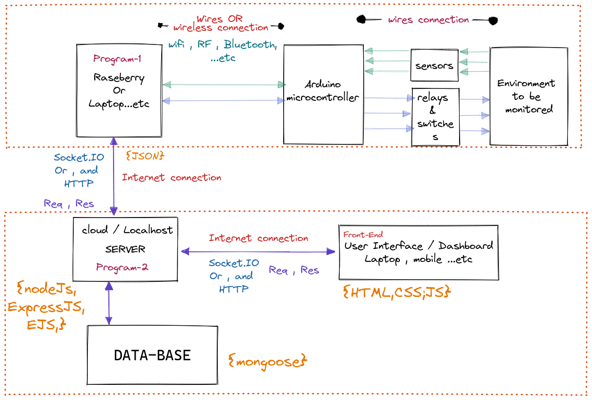

# green house micro controllers

## Project's Idea

The Idea for this project is to build a product from A to Z which will monitor a plant environment (temperature, light, soil humidity...etc), check the suitable values which will be entered by the product user online dashboard, then automatically adjust the monitored plant environment

## Project Structure



## Technologies and third parties

    Hardware:
        - Raspberry Pi 4 B 8GB
        - Digital Light intensity Sensor Module for Arduino
        - Soil Moisture Sensor Hygrometer Module V1.2 Capacitive Compatible with Arduino
        - Arduino Pump
        - Cable Jumper 28 AWG Wire Bridges for Arduino Raspberry Pi

    Software:
        - ReactJS
        - NodeJs
        - "dependencies": {
                "cors": "^2.8.5",
                "dotenv": "^16.0.0",
                "express": "^4.17.3",
                "express-session": "^1.17.2",
                "express-validator": "^6.14.0",
                "mongoose": "^6.2.7",
                "mongoose-unique-validator": "^3.0.0",
                "nodemailer": "^6.7.2"
                },

## project working tree

## User registration

    * status: Every new user must be created with “Pending” status by default. After registration, he will receive a confirmation email with an activation link. By clicking on it, his status will be updated to “Active”.
    * confirmationCode: A unique token for each user.

    # Book Store Project


<br>
The Data stored in two collections: books and authors.
<br>
## Project's Packages
> In this Project, The following packages are used:
<br>
├── bootstrap@5.1.3<br>
├── dotenv@16.0.0<br>
├── ejs@3.1.6<br>
├── express@4.17.3<br>
├── jquery@3.6.0<br>
└── mongoose@6.2.3
## Project's Structure:

```sh
Root
├── data
│   ├── authors.json
│   └── books.json
├── models
│   └── mongo.js
├── public
│   ├── css
│   │   └── style.css
│   └── js
│       └── script.js
├── routes
│   ├── admin.js
│   └── index.js
├── views
│   ├── partials
│   │   ├── modal.ejs
│   │   └── navbar.ejs
│   ├── addAuthor.ejs
│   ├── addBook.ejs
│   ├── book.ejs
│   ├── error.ejs
│   ├── index.ejs
│   └── search.ejs
├── app.js
├── package.json
├── package-lock.json
├── .env
└── README.MD
```
## Project's Environmenet
> Create ```.env``` file and make sure to put those varables with your values in Atlas mongodb:
```sh
PORT=3000
# DONT USE 'USER' VARIABLE, it's reserved By SYSTEM!!!
DBUSER=<YOUR_CLUSTER_USER_IN_ATLAS>
PASSWORD=<YOUR_CLUSTER_PASSWORD>
DATABASE=bookstore
```
